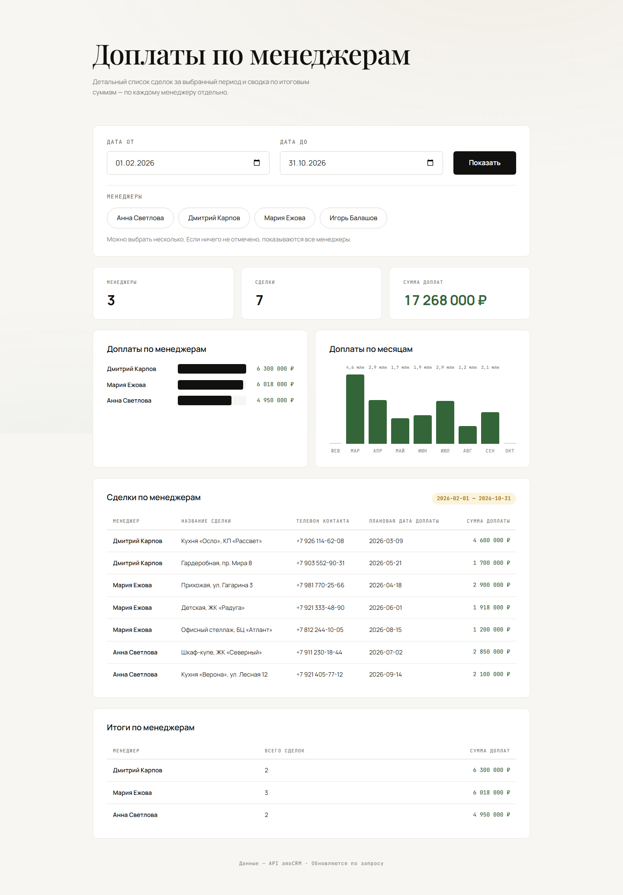

## Как это выглядит




## Быстрый старт

```bash
git clone https://github.com/<ваш-логин>/dashboard-amocrm.git
cd dashboard-amocrm
```

Дальше — настройка доступа и базы:

1. Скопируйте `.env.example` в `.env`
2. Заполните строки:
   - `AMO_BASE_URL` — адрес вашего портала, например `https://mycompany.amocrm.ru`
   - `AMO_ACCESS_TOKEN` — долгоживущий токен из интеграции amoCRM
   - `DATABASE_URL` — строка подключения к Postgres (например, бесплатный [Neon](https://neon.tech) → Connection string, pooled)

И запуск:

```bash
npm install     # ставит драйвер Postgres (pg)
npm start       # при пустой базе сам выполнит первичный бэкфилл из amoCRM
```

Дашборд откроется по адресу `http://127.0.0.1:3000`. Нужен Node.js 18 или новее и доступный Postgres (зеркало сделок хранится в нём, а не в файле — поэтому хостинг не требует постоянного диска).

## Деплой на Render

Проект — обычный Node-сервер, поэтому разворачивается на любой платформе, которая запускает Node-процесс. Пример для [Render](https://render.com):

1. Запушьте проект на GitHub.
2. На Render: **New → Web Service** и подключите репозиторий.
3. Настройки сервиса:
   - **Build Command:** `npm install`
   - **Start Command:** `npm start`
4. В разделе **Environment** добавьте переменные (в репозитории их нет — `.env` в `.gitignore`):
   - `DATABASE_URL` — строка подключения Neon (pooled, с `sslmode=require`)
   - `AMO_BASE_URL` — адрес портала, например `https://mycompany.amocrm.ru`
   - `AMO_ACCESS_TOKEN` — долгоживущий токен amoCRM
   - `AMO_WEBHOOK_SECRET` — случайный токен для URL вебхука и реконсиляции
   - `PORT` задавать не нужно — платформа подставит свой.
5. Deploy. Дашборд откроется по адресу вида `https://имя.onrender.com`.

> Данные лежат во внешнем Postgres, поэтому постоянный диск не нужен и сервис работает на бесплатном плане. Чтобы free-сервис не терял вебхуки во сне, настройте внешний пинг `GET /` (раз в ~10 мин) и ночную реконсиляцию `POST /resync/<AMO_WEBHOOK_SECRET>` — она пересобирает зеркало из amoCRM. Подробности — в `ТЗ-postgres.md`.

> Сервер слушает порт из переменной `PORT` и привязан к `0.0.0.0`, поэтому доступен снаружи контейнера. На Vercel проект в текущем виде не работает: это serverless-платформа без постоянного процесса.

## Что внутри

```text
src/server.js      # веб-сервер: отдаёт страницу и принимает запросы от неё
src/amocrm.js      # получает из amoCRM сделки, контакты и менеджеров
src/dashboard.js   # считает доплаты и собирает данные для отчёта
public/            # сама страница: вёрстка, стили, графики
tests/             # автотесты расчётов и сервера
.env.example       # шаблон настроек (токен хранится только у вас)
```

## Какие сделки попадают в отчёт

- Берутся сделки, у которых плановая дата доплаты лежит в выбранном периоде
- Доплата считается как сумма сделки минус предоплата
- Если доплачивать нечего (ноль или меньше) — сделка не показывается
- Завершённые и замороженные сделки исключаются автоматически

## Стек

Node.js с единственной внешней зависимостью — драйвером Postgres `pg` (для зеркала сделок). Весь остальной код — сервер, расчёты, синхронизация — на встроенных модулях Node. Страница дашборда — обычные HTML, CSS и JavaScript, графики нарисованы без сторонних библиотек.
